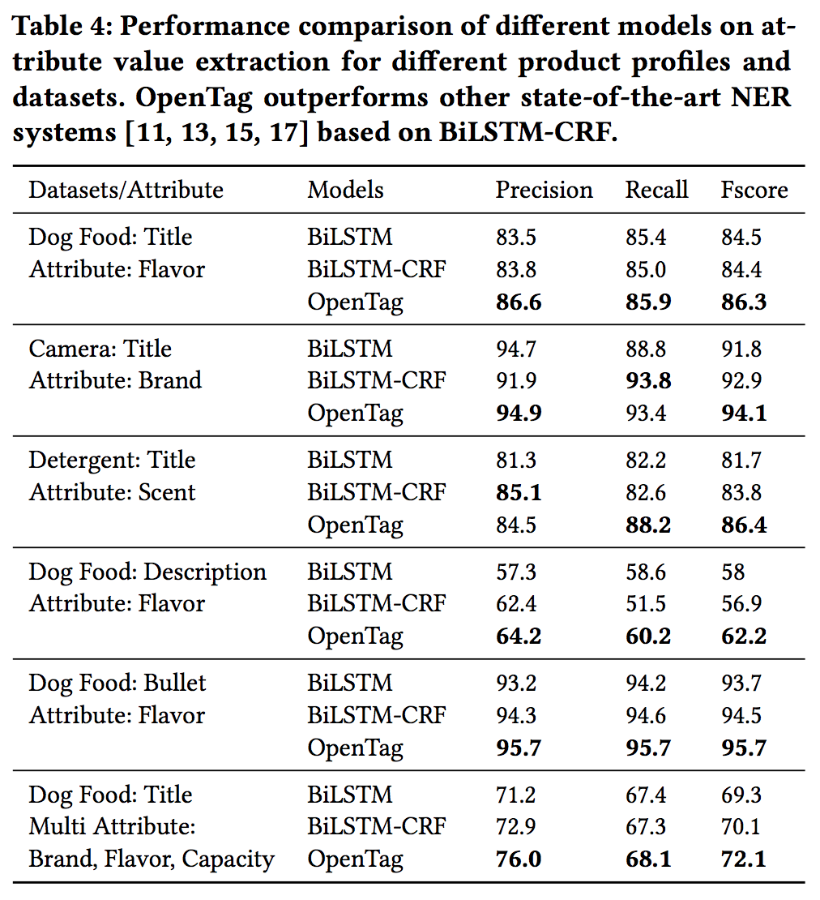
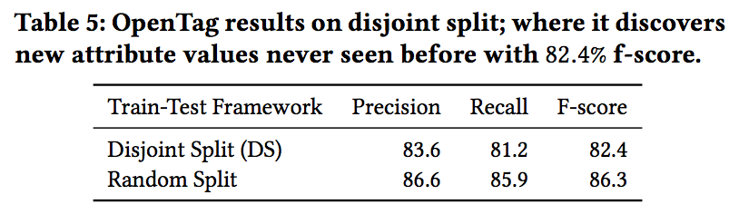
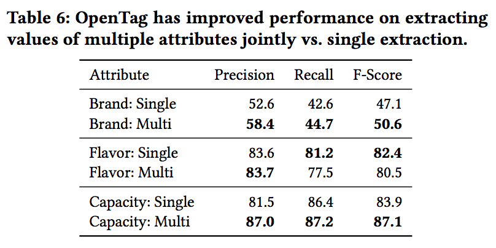
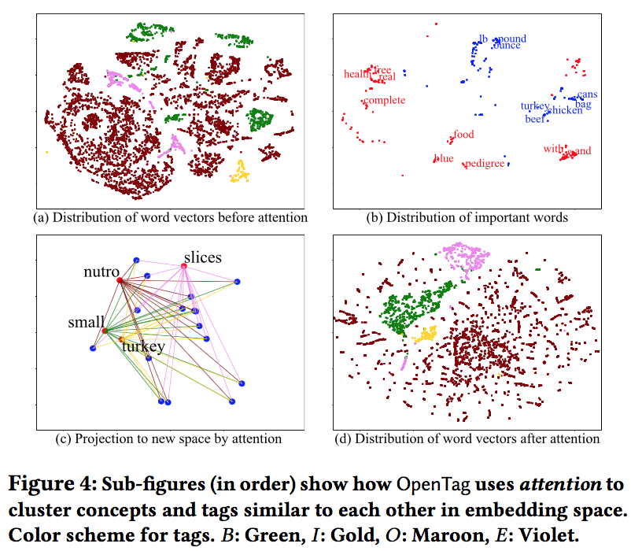
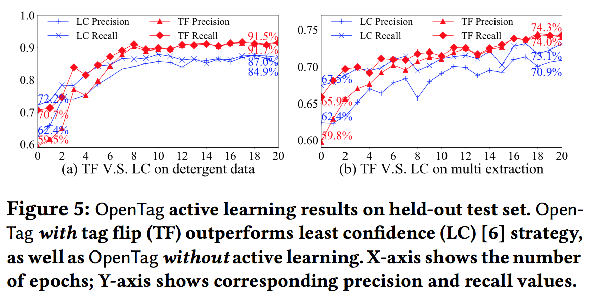
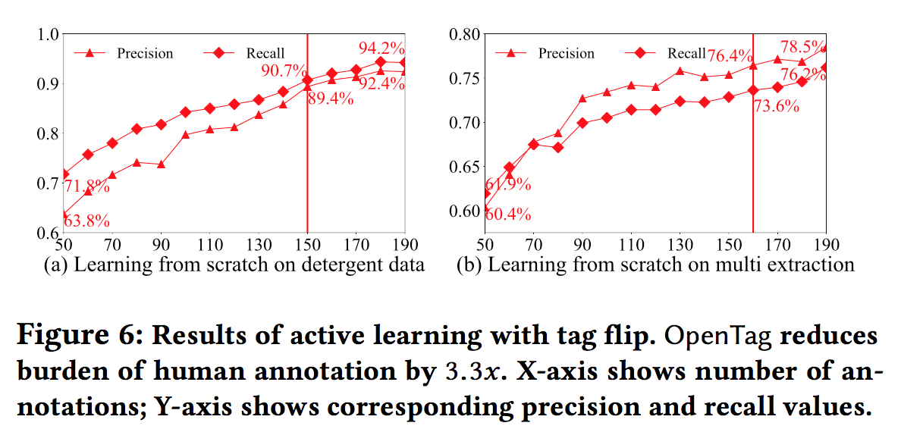

https://arxiv.org/pdf/1806.01264.pdf

| title        | OpenTag: Open Attribute Value Extraction from Product Profiles                                                                    |
| ------------ | --------------------------------------------------------------------------------------------------------------------------------- |
| author       | Guineng Zheng (University of Utah), Subhabrata Mukherjee (Amazon.com), Xin Luna Dong (Amazon.com), Feifei Li (University of Utah) |
| year         | 2018                                                                                                                              |
| organization | KDD                                                                                                                               |

# 要約

新規性を主張しているポイント
- RNN(BiLSTM)とCRFを結合した問題として定式化した
  - LSTM+CRF自体は既に存在しているがブラックボックスで説明不可能。本研究ではattentionメカニズムによりモデル解釈が可能
- ユーザにモデルの決定を対話的に説明するための新しいattentionメカニズムを開発した
- 手で作った学習データが少なくて済む新しいサンプリング手法を提案した
  - 通常の3分の1程度の150個のアノテーションサンプルで、最先端の手法を超える83%のF値を出した

提案手法
- OpenTag:BiLSTM-CRF with Attention
  - 手法の特徴
    - Open World Assumption : 学習時に無い新しい属性値を見つけることができる。(書いてないので恐らく属性は定義されたもののみ)
    - Irregular structure and sparce context : 文法構造が欠落していたり、文脈がスパースでも利用できる
    - Limited annotated data : 学習データが少なくて済む。active learningによって人の負荷も少ない
    - Interpretability : attentionメカニズムを用いてデバッグを行うことができる
  - 構成
    - word sequence(入力データ) → word embedding → BiLSTM → attention Layer → CRFで{B,I,O,E}を付ける
  - active learning
    - 最初に少数のラベル付データを用意(100個程度)。その後、学習しながらルールに従ってラベル付対象のデータを選択し、人間がラベル付する
      - 人手で最初に大量の学習データを用意するよりは、学習しながら精度向上に有効なデータにラベリングした方が人への負荷は少ない
    - ラベル付されていないデータに対して現在のエポックのパラメータセットと前回のエポックのパラメータセットでタグを付与。付与されたタグが異なる個数が多いものをラベリングの対象とする
  - 結果の解釈(attentionの効果)
    - attention matrixを見ると抽出に影響している単語が確認できる(Fig3参照)

手法の評価
- 評価対象のデータ。レコードは1,000件以下(Table 3参照)
  - ドッグフード(属性：ブランド、味、容量。属性を単独で抽出するパターンと、3属性を同時に抽出するパターンで検証)
  - カメラ(属性：ブランド)
  - 洗剤(属性：香り)
- 比較対象
  - Baseline：BiLSTM[10]
  - state-of-the-art:BiLSTM
  - 提案手法:OpenTag
- Accuracy、Recall、F値で評価。提案手法がだいたい高い(Table4参照)
- 未知語に対する抽出精度も高い。既往研究との比較はなし(Table5参照)
- 提案したactive learningも既存手法よりエポックに対する精度向上が早い(Figure5,6参照)

所感
- ECの商品説明は文法構造がなく単語の羅列になっているので、スパース性の考慮は同様に必要な気もする
- 人が用意する学習データは少なくて済むが、最初に150個用意するのではなく随時データを追加になるので運用方法は考える必要がある
  - 人がラベリングするデータの個数は減るので人への負荷は下がるかもしれないが、今の仕組みだとエポック毎にactive learningが走ってしまうので人のラベリングが学習時のボトルネックになってしまう
- 1つのドメインに対しては1つの属性より複数属性を同時にやった方が精度が高くなるのは直感的に分かる
  - ドメインごとに学習を分けているので、複数ドメインのデータを同時に学習するのは効率が悪いのかもしれない(本文には記載なし)

# 各章のメモ

## 3：OPENTAG MODEL: EXTRACTION VIA SEQUENCE TAGGING

### 3.1 Bidirectional LSTM (BiLSTM) Model

### 3.2 Tag Sequence Modeling with Conditional Random Fields and BiLSTM

#### 3.2.1 Conditional Random Fields (CRF)

#### 3.2.2 Bidirectional LSTM and CRF Model

### 3.3 OpenTag: Attention Mechanism

### 3.4 Word Embeddings

### 3.5 OpenTag Architecture: Putting All Together

OpenTagの構成の全体像

- Fig2はword embedding に「duck , fillet mignon and ranch raised lamb flavor」の最後の4文字が渡されてタグが予測されている状況を表している(Table1のBIOEと一緒に見ると分かりやすい)。
- 入力された文字列はWord Embeddingでベクトル表現される
- ベクトル表現された単語はBiLSTMの入力となり、LSTMの出力は隠れ層のままattentionレイヤーへの入力となる
- attentionレイヤーの出力値はCRF層の入力となり、{B,I,O,E}のタグ付けが実施される

## 4 OPENTAG: ACTIVE LEARNING

- leanerがラベル付けされていないプールされたデータから、ラベリングして欲しいサンプルを選択する
- 最初に少数のラベル付されたデータセット$L$を用意し、leanerが対話的に大量のラベル付けされていないデータ$U$からラベル付して欲しいデータを要求する
  - ラベル付けして欲しいデータはquery strategy $Q$で選ばれる
  - ラベル付けされたデータは$L$に追加される
  - このラベル付は閾値を満たすまで繰り返される
- active learningのbaseline : least confidence(LC)
  - confidentが最も小さいサンプルをラベリングの対象にする
  - 本研究だとCRFの出力のconfidenceを用いる
- avtive learningの提案手法 : tag flip
  - least confidenceには欠点が2つある
    - confidenceはタグ付与確率であって、タグ付けが正しかったかどうかは反映されない
    - タグ付けの規則性が明確になった時に他のタグには効果が薄い
  - tag flipではタグの付与が困難だった度合いを元にquery strategy を組む
  - エポックeとe-1のそれぞれのパラメータ $\Psi^e$ $\Psi^{e-1}$ を用いてラベル付されていないデータUのデータに対してタグ付けを行う。その時にシーケンスの単語それぞれにタグが付与されるが、$\Psi^e$ $\Psi^{e-1}$ で付与されたタグが最も多いデータを人間にタグ付けしてもらうデータとして選択する(だからtag flip)
  - ラベル付する対象のデータはバッチ毎に行う(Algorithm1を見ると分かる)

### 4.1 Method of Tag Flips

## 5 EXPERIMENTS

### 5.1：OpenTag:Training
- TensorflowとKerasを使用。マシンは72コア

- 埋め込み表現のためにGloVeを用いて学習済みの単語ベクトル100次元を利用。
- LSTMの隠れ層は100層。出力は200次元
- ドロップアウト率:0.4
- 最適化にはAdamを利用。バッチサイズは32。
- 500エポック学習し、最後の20エポックで評価を行った

### 5.2：Data sets
- ドッグフード、カメラ、洗剤の3ドメインのデータを利用
- 利用した商品データはAmazon.com公式ページのタイトル、商品説明、箇条書き
- 利用可能な属性はドメインごとに定義する。OpenTagもドメインごとに学習
- サンプル数と抽出された属性数はTable3参照
- 学習とテストではデータは重複しない

- Evaluation measure
  - precision
  - recall
  - f-score

flavorが"ranch raised lamb"があった時に3語とも抜けないと正解にしない

### 5.3：Performance: Attribute Value Extraction
比較対象
- Baseline：BiLSTM[10]
- state-of-the-art:BiLSTM and CRF[11,13,15,17] ただし、辞書やhand-crafted featuresを利用しない
- OpenTag:提案手法

**Tagging strategy**
{B,I,O,E}を採用。他の方法も試したがこれが良かった
Attribute value extraction result

**Attribute value extraction results**

全てRandom train-test splitで評価。

descriptionといった文脈がわかりやすいものだと最大でstate-of-artのBiLSTM-CRFよりOpenTagの方が5.3%良かった。ただし、全体的なパフォーマンスは良くなかった？
この辺よくわからない

**Discovering new attribute values with open world assumption(OWA)**

新しい特徴値を発見できているかの評価。いかなる属性値も学習データとテストデータで共有されないようにデータを分割した。Random splitは比較対象。baselineとの比較はないのか？

**Joint extraction of multi-attribute values**

複数の属性値を抽出できるかのテスト。brand、favor、capacityをドッグフードのデータのtitles(disjoint split学習とテストで属性が被らないsplit)でテスト。{B,I,O,E}を使う。属性aごとに{B,I,E}をつける。

Table 4(前述のTable)のMulti AttributeのBiLSTM+CRFとOpenTagのf値を比較すると2%精度が上がっていた。

Multi Attributeのほうが意味的な分散を活用できるので、Single Attributeよりも精度を上げることができる。ブランドや容量の精度は上がったが、flavorの性能は下がってしまった

### 5.4 OpenTag: Interpretability via Attention

**Interpretable explanation using attention**

OpenTagで学習を行った場合のAttention Matrix Aのヒートマップ。隣接する単語との重要度が高いものを表している。これによってタグの決定にどう影響しているか分かる。Fig3の例を見てみると、真ん中に白い四角が4つあり、列に(with,and)行に(beef,liver)がある。flavorのattributeが隣接して2つある場合も抽出できる？Fig3の例だとwithとandがトリガーとなってflavorのbeefとliverが抽出されていることになる？

**OpenTag achieves better concept clustering**

ドッグフードのタイトルでflavorを抽出下際の結果。t-SNEを使ってBiLSTMの隠れ層(サイズ200)を2次元に圧縮した。色は{B,I,O,E}。
(b)重要そうな単語をピックアップ。接続詞(with,and,&など)が右下に集まっており、上には量を表す語(pound,ounce,lb)がまとまっている。
attention machanismによって重要な単語が協会に現れている？といっているみたい。細かいロジックはよくわかってないが、attentionによって{B,I,O,E}が上手くまとまっているということらしい。Fig4の(d)

### 5.5 OpenTag with Active Learning: Results

#### 5.5.1 Active Learning with Held-Out Test Set

Table3はUとHの比率を2 : 1。最初に50個の少ないラベリングされたサンプリングから始める。
Fig5はactive learningを20round行った結果。(a)洗剤のタイトルからscent-attributeを抽出(b)ドッグフードのタイトルからマルチ属性(ブランド、容量、flavor)を抽出を行った結果。

Active Learningを行うとstate-of-artとの比較を行っているTable4の結果より良くなる。Tag Flipの方がLeast Confidenceより良い。LC=least confidence、TF=tag flip

#### 5.5.2 Active Learning without Held-out Data

active learningが人のアノテーションの負荷を下げることができるのか調べた。50個のラベルが付けられたセットから始める。何ラウンドで要求された性能(ここでは500個のラベル付データでOpenTagで学習した性能)に到達するか。Tag Flipが前のセクションで性能が良かったので使っている。Active learningだと50個から始めて150個まで増やせば、500個で最初にまとめて学習した結果と同程度の性能が出せている

## 6 RELATED WORK
- Rule-based extraction techniques [21]
- rule-based and linguistic approaches leveraging syn-tactic structure of sentences to extract dependency relations[3, 18]
- NER system was built to annotate brands in product listings of apparel products[25]
  - They used seed dictionaries containing over **6,000** known brands for bootstrapping
- Neaural Networks for sequence taggingは少ない
  - A multi-label multi-class Perceptron classifer for NER is used[16]
  - LSTM-CRF model is used[13]
  - They used **37,000** manually labeled search queries to train

この辺を見ると既存の研究の学習に必要なタグがかなり多い(というかOpenTagが極端に少ない？)ように見える

- Early attempts include [9, 23], which apply feed-forward neural networks (**FFNN**) and LSTM to NER tasks
- [5] combine deep FFNN and word embedding [19] to explore many NLP tasks including POS tagging, chunking and NER
- **Character-level CNNs** were integrated [26] to augment feature representation, and their model was later enhanced by LSTM [4]
- Huang et al. [11] adopts CRF with BiLSTM for jointly modeling sequence tagging
- Lample et al. [15] use BiLSTM to encode both **character-level and word-level feature**
- Ma et al. [17] replace the **character-level** model with CNNs

Currently, BiLSTM-CRF models as above is state-of-the-art for NER.

- Bahdanau et al. [1] successfully applied attention for alignment in NMT systems
- Early active learning for sequence labeling research [7, 27] em- ploy least confidence (LC) sampling strategies

## 7 CONCLUSIONS
- BiLSTM, CRF, attentionを活用したend-to-endのタグ付与システムOpenTagを示した。これはタイトルや説明文、箇条書きから未知の属性も取得できる
- OpenTagは辞書や手作業で作成した特徴を学習時に必要としない
- OpenTagの特徴
  - Open World Assumption : 学習時にない新しい属性値を見つけることができる。マルチワードの属性値やマルチ属性の抽出でも同様
  - Irregular structure and sparce context : 文法構造が欠落していたり文脈がスパースでも利用できる
  - Limited annotated data : 学習データが少なくて済む。active learningによって人の負荷も少ない
  - Interpretability : attentionメカニズムを用いてデバッグを行うことができる
- 現実のデータを利用してたった150個(3.3倍の効果。多分500個に対してなので5.5.2の結果に基づいていると思われる)のアノテーションサンプルで新しい属性を発見でき、83%という高いF値を出せる

# 略語
| term | discription               |
| ---- | ------------------------- |
| DS   | disjoint training         |
| LC   | least confidence          |
| TF   | tag flip                  |
| CRF  | conditional random fields |

# 変数
- $a$ : Attribute
- $A$ : Attention Matrix
- $B$ : batch size
- $U$ : unlabeled pool
- $H$ : blind held-out test set
- $L$ : initial labeled set
- $d$ : embedding dimension
- $E$ : epochs
- $e$ : epoch(embeddingと被ってる・・・)
- $e_t$ : embedding vector
- $h_t$ : hidden state representation
- $I()$ : indicator function that assumes the value 1 when the argument is true, and 0 otherwise
- $\langle l_t \rangle$ : attention-focused hidden state representation
- $Q^{tf}$ : the number of tag flips of tokens of a sequence across successive epochs
- $t$ : time
- $x_t$ : each token
- $\langle x_t \rangle$ : input sequence
- $y^*$ : the final output is the best possible tag sequence
- $m$ : training instance
- $\Psi$ : all parameter
