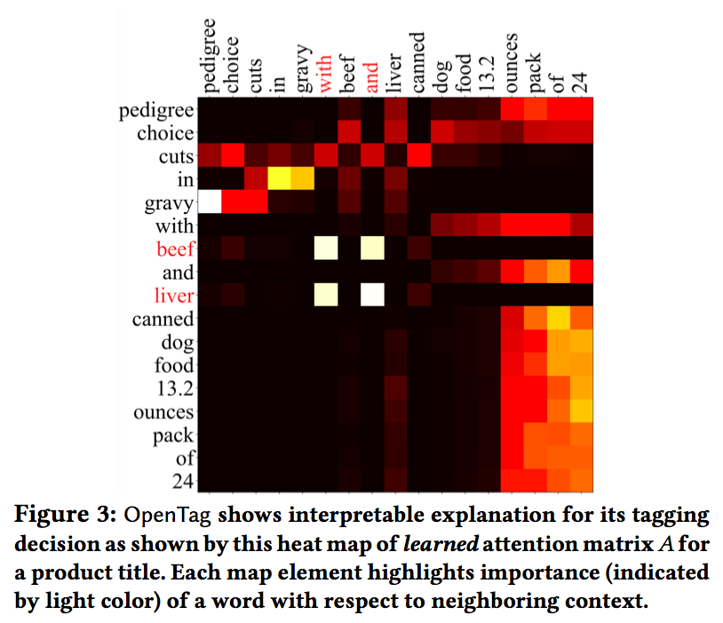

https://arxiv.org/pdf/1806.01264.pdf

# title
|          |                                                                |
| ------------ | -------------------------------------------------------------- |
| title        | OpenTag: Open Attribute Value Extraction from Product Profiles |
| author       | Guineng Zheng (University of Utah), Subhabrata Mukherjee (Amazon.com), Xin Luna Dong (Amazon.com), Feifei Li (University of Utah)                                                               |
| year         | 2018                                                           |
| organization | KDD                                                            |

# EXPERIMENTS

## 5.1：OpenTag:Training
## 5.2：Data sets
- Evaluation measure
  - precision
  - recall
  - f-score

flavorが"ranch raised lamb"があった時に3語とも抜けないと正解にしない

## 5.3：Performance: Attribute Value Extraction
比較対象
- Baseline：BiLSTM[10]
- state-of-the-art：BiLSTM and CRF[11,13,15,17] ただし、辞書やhand-crafted featuresを利用しない

**Tagging strategy**
{B,I,O,E}を採用。他の方法も試したがこれが良かった
Attribute value extraction result

**Attribute value extraction results**

全てRandom train-test splitで評価。

descriptionといった文脈がわかりやすいものだと最大でstate-of-artのBiLSTM-CRFよりOpenTagの方が5.3%良かった。ただし、全体的なパフォーマンスは良くなかった？
この辺よくわからない

**Discovering new attribute values with open world assumption(OWA)**

新しい特徴値を発見できているかの評価。いかなる属性値も学習データとテストデータで共有されないようにデータを分割した。Random splitは比較対象。baselineとの比較はないのか？

**Joint extraction of multi-attribute values**

複数の属性値を抽出できるかのテスト。brand、favor、capacityをドッグフードのデータのtitles(disjoint split学習とテストで属性が被らないsplit)でテスト。{B,I,O,E}を使う。属性aごとに{B,I,E}をつける。

Table 4(前述のTable)のMulti AttributeのBiLSTM+CRFとOpenTagのf値を比較すると2%精度が上がっていた。

Multi Attributeのほうが意味的な分散を活用できるので、Single Attributeよりも精度を上げることができる。ブランドや容量の精度は上がったが、flavorの性能は下がってしまった

## 5.4 OpenTag: Interpretability via Attention

**Interpretable explanation using attention**

OpenTagで学習を行った場合のAttention Matrix Aのヒートマップ。隣接する単語との重要度が高いものを表している。これによってタグの決定にどう影響しているか分かる。Fig3の例を見てみると、真ん中に白い四角が4つあり、列に(with,and)行に(beef,liver)がある。flavorのattributeが隣接して2つある場合も抽出できる？

このへんはAttentionを理解してないとキツそう

**OpenTag achieves better concept clustering**

# 略語
| term | discription       |
| ---- | ----------------- |
| DS   | disjoint training |
|      |                   |

# 変数
a : Attribute
A : Attention Matrix

$$\frac{x}{t}$$
